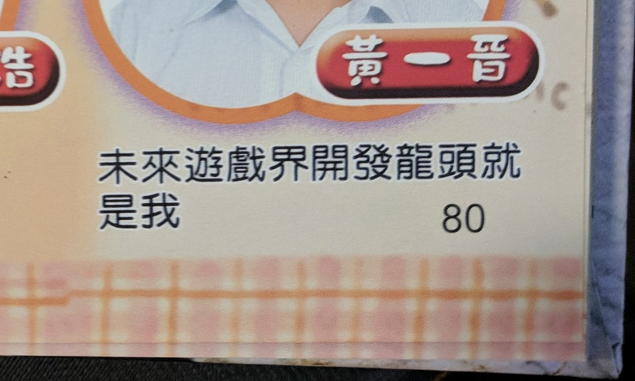
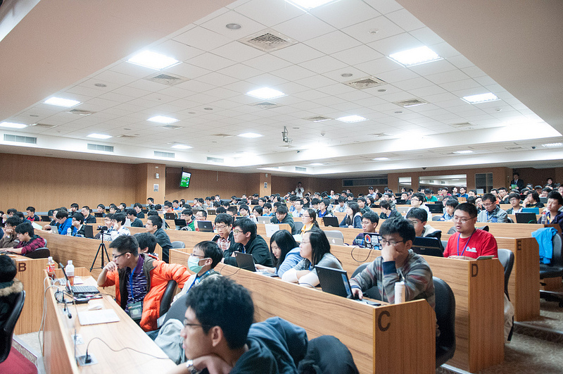

title: 開放源碼與他們的產地 - 社群經歷談
output: index.html

--

<h1 style="font-size: 72px">
	開放源碼與他們的產地 -  
	社群經歷談
</h1>
 

## Denny Huang
## 2018/12/14 @ 中正大學

--

<h1 style="font-size: 72px">
線上發問
https://www.sli.do/ccu
</h1>

--

### Who am I ?

 
<h2 style="font-size: 60px">
  <b>Denny Huang</b>
</h2>

* 雷亞遊戲 Rayark Inc.

* SITCON 學生計算機年會

* <a href="https://denny.one/" target="_blank">About me</a>

--

<iframe width="800" height="600" src="https://www.youtube.com/embed/SU7OPfLO7d8?rel=0&amp;controls=0&amp;showinfo=0&amp;loop=1&amp;end=12&amp;mute=1" frameborder="0" allow="autoplay; encrypted-media" allowfullscreen></iframe>

--

### Sdorica
<iframe width="800" height="600" src="https://www.youtube.com/embed/2aY7il7zuNk?rel=0&amp;controls=0&amp;showinfo=0&amp;" frameborder="0" allow="autoplay; encrypted-media" allowfullscreen></iframe>

--

# 夢想

--

### 國中畢業紀念冊

	

--

	

--

	

--

	

--

	

--

	

--

# 學校教育？

--

# Linux

--

# Free Software, Open Source, FLOSS
## [ref1](http://www.openfoundry.org/tw/legal-column-list/508-2010-07-15-10-50-34) / [ref2](https://www.gnu.org/philosophy/free-software-for-freedom.html)

--

<iframe width="780" height="500" src="https://www.youtube.com/embed/6NhyCXJU-IQ" frameborder="0" allowfullscreen></iframe>

  
     By Bit Blueprint / Jimmy Huang
  

--

# Richard Stallman

--

# GNU

--

# Linus Torvalds
## Linux

--

# GNU/Linux

--

### History

* [鳥哥的 Linux 私房菜](http://linux.vbird.org/linux_basic/0110whatislinux.php)
* [Unix传奇(上篇)](http://coolshell.cn/articles/2322.html)
* [Unix传奇(下篇)](http://coolshell.cn/articles/2324.html)

--

# [Linux Distro](./img/Linux_Distribution_Timeline.svg)
## [GNU/Linux Distribution Timeline](https://github.com/FabioLolix/LinuxTimeline)
## [DistroWatch](http://distrowatch.com/)

--

# 獨立思考

--

# 駭客精神

--

### Aaron Swartz

	

--

### Edward Snowden

	

--

<h1 style="font-size: 58px">
	上次看完一本書是什麼時候？ 
</h1>

--

 

	

--

# 學習方式

--

 

	

--

# 大學 / 研究所

--

# 家庭鬥爭？

--

# 斜槓青年

--

# 第一份打工?

--

	

--

	

--

	

--

# 社團

--

# 社群

--

# OpenFoundry

--

# COSCUP

--

# SITCON
## [緣起](https://www.facebook.com/notes/denny-huang/sitcon-%E5%85%A9%E5%B9%B4/705790116160130/)

--

 

	

--

	

--

	

--

	

--

# [SITCON 2019](https://sitcon.org/2019/)
## 2019/03/24
## 中央研究院

--

# 聲明

--

# Q & A

--

<h1 style="font-size: 72px">
  Thanks for listening!
</h1>

   

  

<h2 style="font-size: 18px">
本投影片採用<a href="http://creativecommons.org/licenses/by-sa/3.0/tw/" target="_blank">創用 CC「姓名標示—相同方式分享 3.0 台灣」授權條款</a>
</h2>

